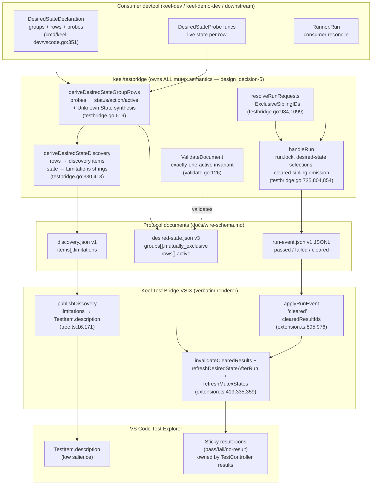
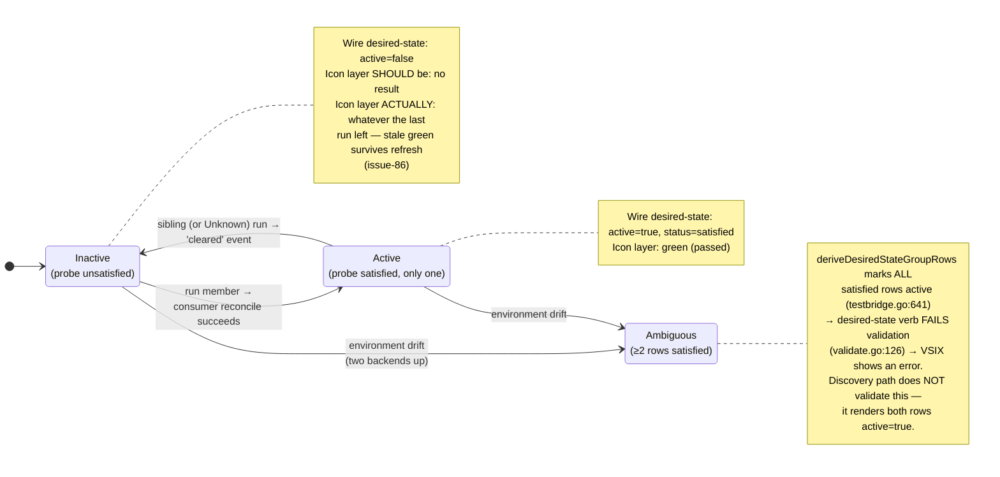

# Mutex architecture — components, state representations, invariants

Code references are current at 2026-07-17 (`main`). See
[README.md](README.md) for the record trail and [sequences.md](sequences.md)
for the flows.

## Component map

## The four representations of mutex state

This is the heart of `rca-3` root cause #1: four surfaces, each capable
of telling a different story, none authoritative.

| # | Surface | Producer | Where it lives | Salience to the user | Reconciled when |
|---|---|---|---|---|---|
| 1 | Desired-state rows (`active`, `status`, `action`) | `deriveDesiredStateGroupRows` re-executes probes | `desired-state.json` v3; Test Results output text | Low (text panel) | Every `desired-state` call |
| 2 | Discovery metadata (`Limitations`: `current=`, `action=`, `active=`, `mutually_exclusive=`) | `desiredStateDeclarationDiscoveryItems` (testbridge.go:436,473) | `discovery.json` → `TestItem.description` (tree.ts:171) | **Low** — small grey text | Every refresh |
| 3 | Run-event stream (`passed` winner, `cleared` siblings) | `runDesiredStateSelections` + `emitExclusiveDesiredStateSiblingClears` (testbridge.go:804,854) | JSONL during a run | Transient | Only **during a run** |
| 4 | VS Code result icons | `run.passed/failed` + `invalidateTestResults` + item replacement | TestController result store — **sticky, survives refresh** (issue_fix-47/CR-78) | **Highest** — the green/red badge | Only after a run (`refreshMutexStates`, CR-119). **Never at rest** — `keel/issue-86` |

The owner sees #4. Fixes have repeatedly landed in #1–#3.

## Per-row state machine

One concrete member of an exclusive group, as the four surfaces see it:

`Unknown State` is the bridge-synthesized reset peer
(`exclusiveUnknownState`, testbridge.go:662): always
`satisfied/reuse`, `active` iff no concrete row is satisfied. Selecting
it is the "deactivate everything" action — it passes itself and emits
`cleared` for every concrete sibling. **It is intentional, not a bug**
(rca-3 evidence notes).

## Invariants and where they are (not) enforced

| Invariant | Source | Enforced by | Gaps |
|---|---|---|---|
| Exactly one `active=true` row per exclusive group | wire-schema.md; requirement-88 | `validateDesiredStateDocument` (validate.go:126) — desired-state verb only | Discovery path never validates it; ambiguity renders as two `active=true` descriptions instead of an explicit error state (rca-3 root #4 — fail-closed on one surface, silent on the other) |
| At most one member carries a result after activation | requirement-88 | `cleared` events → `invalidateClearedResults` + `replacePublishedTestItem` (extension.ts:419, tree.ts:70) | Fires **only** on an activation run. At rest / plain refresh: nothing (issue-86) |
| Exclusive groups are not group-runnable | requirement-83/84, dd-4 | `runnable = !MutuallyExclusive && …` (testbridge.go:423); `resolveRunRequests` rejects non-runnable groups | — |
| Non-exclusive groups ARE group-runnable (expand to rows) | requirement-83/84 | `resolveRunRequests` group expansion (testbridge.go:1020) | — |
| Every run ends with exactly one `run_finished` + `exit_code` | wire-schema.md | `handleRun` defer discipline (testbridge.go:784) | — |
| `run_id` unique across all groups | validate.go:117 | desired-state verb | Same discovery-path blindness as exactly-one-active |
| VSIX applies bridge decisions verbatim, no `mutually_exclusive` branching | design_decision-5 | convention/review | **Violated by `refreshMutexStates`** (extension.ts:359, CR-119/requirement-93) — see Tensions |

## Identity plumbing (how a row becomes an icon)

- A **runnable** row's discovery/tree/run id is its consumer-declared
  `RunID`, verbatim (testbridge.go:457). Informational rows get a
  synthesized `…::row::<slug>` id; the VSIX additionally has a private
  display-id namespace for informational rows that is **never** sent to
  the devtool (extension.ts:642).
- The group item id is `<parent>::group::<slug>`; the Unknown peer is
  `<group>::unknown` (testbridge.go:682).
- The bridge detects "is this a desired-state group / an exclusive
  group" by **parsing its own `Limitations` strings back**
  (`desiredStateGroupItem`, testbridge.go:1065; `hasLimitation
  mutually_exclusive=true`, testbridge.go:1104). The exclusivity flag is
  tunneled through a human-readable string list that doubles as the
  VSIX's `description` — a stringly-typed self-contract.

## Design tensions

These are the unresolved contradictions any fix CR must take a position
on:

1. **dd-5 vs requirement-93.** `design_decision-5` ("VSIX stays
   business-logic-free — no branching on `mutually_exclusive`") vs
   `refreshMutexStates` (extension.ts:359), which loops
   `desiredState.groups`, branches on `group.mutually_exclusive` and
   `row.active`, and rebuilds items. rca-3's corrective direction ("fix
   at the bridge run-event stream, not VSIX branching") points one way;
   the shipped CR-119 code points the other. Amend dd-5 or move the
   logic — currently we have both doctrines at once.
2. **Result icons as state display.** VS Code result icons are terminal
   verdicts of *runs*; the mutex model uses them as *current-state*
   indicators. Everything downstream (sticky results surviving refresh,
   `invalidateTestResults` merely marking outdated instead of removing,
   the `replacePublishedTestItem` workaround) is friction from that
   category error. The alternative in rca-3: exclusive members stop
   carrying persistent pass/fail results entirely and state lives in a
   purpose-built surface.
3. **Split enforcement of exactly-one-active.** Fail-closed error on the
   desired-state verb, silent double-active on the discovery path. Pick
   one behavior (dev_defaults fail-closed says: error on both).
4. **Probe TOCTOU + cost.** Probes re-execute independently per surface
   (see [sequences.md § Probe inventory](sequences.md#probe-execution-inventory));
   two passes in the same refresh can disagree mid-transition, so
   `description` (from discovery probes) and the icon reconcile (from
   the desired-state document read moments earlier) can diverge.
5. **rca-4, same disease one group over.** Lane runs vs Frameworks/Go
   package rows: state inferred across separate projections
   (`shouldApplyResultToItem` heuristics, extension.ts:1031) with no
   owned settle contract → stuck spinners (issue-84). Any "authoritative
   Test Explorer state" design should cover both, not just group B.
