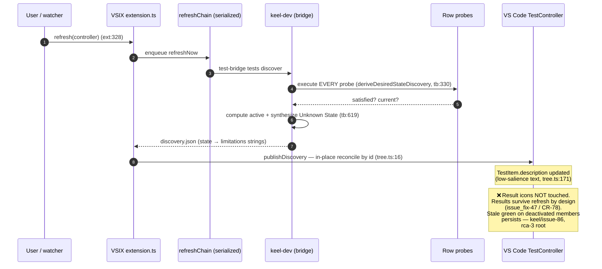
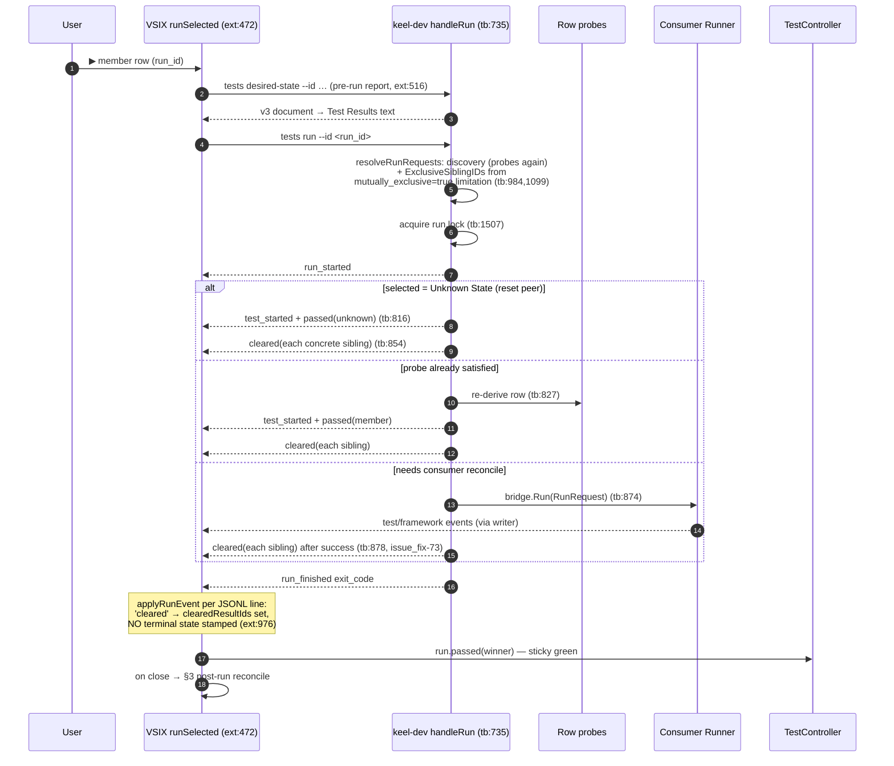

# Mutex sequence diagrams

Line references current at 2026-07-17 (`main`). Companion to
[architecture.md](architecture.md).

## 1. At-rest refresh — where the false-green lives (issue-86)

A plain refresh (watcher event, manual `keel.tests.refresh`, VS Code
refresh button) republishes the tree but **never touches result icons**.



`refreshNow` (extension.ts:388) has no desired-state read and no
`refreshMutexStates` call. Icon reconciliation exists **only** on the
post-run path (§3).

## 2. Activation run — selecting an exclusive member

The user hits ▶ on one member of an exclusive group (or on
`Unknown State`).



A probe-unsatisfied row that is *not* consumer-runnable fails the run
(`failed`, exit 1 — tb:837). Note the run path re-runs discovery (and
therefore all probes) just to resolve ids and sibling sets.

## 3. Post-run reconcile (issue_fix-84 / CR-119)

Runs after the child closes, inside the same `refreshChain` slot so it
cannot interleave with a watcher refresh (issue_fix-70 / CR-105).

```mermaid
sequenceDiagram
    autonumber
    participant EXT as VSIX close handler (ext:569)
    participant DEV as keel-dev
    participant P as Row probes
    participant TC as TestController

    EXT->>TC: invalidateClearedResults(clearedResultIds):<br/>invalidate + replacePublishedTestItem<br/>→ genuine no-result (ext:419, tree.ts:70, issue_fix-78)
    EXT->>DEV: tests desired-state --id <selected> (ext:345)
    DEV->>P: probes (pass A)
    DEV-->>EXT: post-run v3 document
    EXT->>DEV: discover (refreshNow)
    DEV->>P: probes (pass B — may disagree with pass A)
    DEV-->>EXT: fresh discovery → republish tree
    EXT->>EXT: refreshMutexStates(doc from pass A) (ext:359)
    Note over EXT: for each mutually_exclusive group:<br/>rows with run_id && !active →<br/>invalidate + replace item → no-result
    EXT->>TC: winner keeps green; losers drop to no-result
    Note over EXT,TC: ⚠ dd-5 tension: this VSIX code branches on<br/>mutually_exclusive/active (see architecture.md §Tensions).<br/>⚠ Only fires after a run — never at rest (§1).
```

## 4. Failure sequence — how the owner keeps catching it

The composite that reopened rca-3:

```mermaid
sequenceDiagram
    autonumber
    actor O as Owner
    participant TC as Test Explorer
    participant EXT as VSIX
    participant ENV as Environment

    O->>TC: activate member A (run) — A green, B cleared ✅
    ENV->>ENV: state drifts outside the editor<br/>(reconcile elsewhere, backend swap,<br/>window reload restores old results)
    O->>EXT: refresh (or just look)
    EXT->>TC: republish tree — descriptions say active=false on A
    Note over TC: Icons unchanged: A green, maybe B green too.<br/>Exclusive group reads "all green".
    O->>O: sees contradiction #1 (icons vs description)
    Note over O: Every fix so far verified surfaces the owner<br/>doesn't look at (maps, events, JSON) — gates<br/>green, editor wrong. rca-3 reopen; issue-86.
```

## Probe execution inventory

Every interaction re-executes consumer probes; there is no caching or
snapshot identity across surfaces.

| Trigger | Probe passes | Path |
|---|---|---|
| Refresh / discover | 1 | `deriveDesiredStateDiscovery` (tb:330) |
| Desired-state verb | 1 (+1 if group-selection resolution needs discovery, tb:561) | `deriveDesiredStateDeclaration` (tb:514) |
| Run | 2–3: resolve discovery (tb:985) + `runDesiredStateSelections` re-derive (tb:827); +1 if the pre-run VSIX report counts | `handleRun` |
| Post-run reconcile | 2: desired-state read + refreshNow discovery | `refreshDesiredStateAfterRun` (ext:335) |

Consequences: probe cost multiplies (slow probes make every refresh
slow), and any two passes can straddle a state transition — the tree's
`description` and the icon reconcile can legitimately disagree within a
single reconcile cycle (TOCTOU; architecture.md § Tensions #4).
