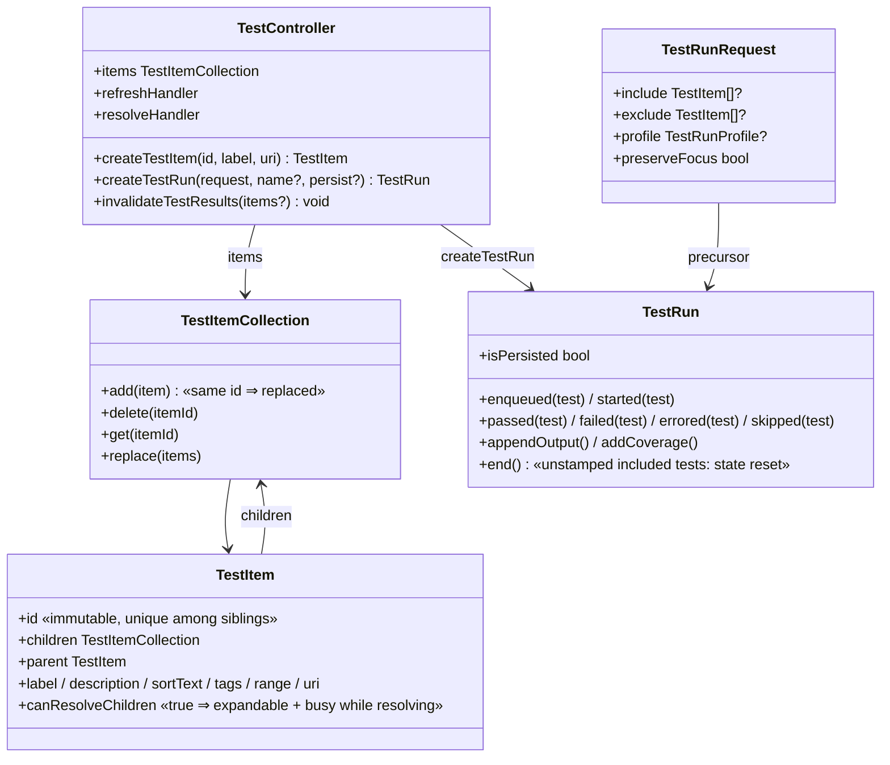

# VS Code testing object model — what the API actually guarantees

Research doc for the mutex-icon fix (rca-3 root #1). Sources: the
`@types/vscode` API contract (`vsix/node_modules/@types/vscode/index.d.ts`,
testing section ~18079–18650), the empirical results already encoded in
the real-controller specs (`vsix/src/test/suite/red-spec.test.ts`,
cr-114/cr-115), production behavior of `externalRunMirror.ts`, and owner
validation on a live editor (iteration-26, issue-86). Every claim below
is tagged with its evidence class:

- **API** — documented contract in `vscode.d.ts`
- **PROVEN** — asserted on a real `vscode.TestController` in our suite, or
  validated by the owner's eyes on a live editor
- **UNPROVEN** — documented or plausible, never observed rendered
- **RULED OUT** — tried and observed not to do what we need

## 1. The objects

## 2. Facts that constrain any mutex-icon design

| # | Fact | Class | Evidence |
|---|---|---|---|
| F1 | **There is no result-readback API.** Stable `vscode.tests` exposes only `createTestController`. An extension can never ask "what icon does item X show?" | API | d.ts:18079–18088; red-spec req-88 comment |
| F2 | **There is no per-item "clear result" API.** | API | d.ts (absence); red-spec req-88 comment |
| F3 | `invalidateTestResults(items)` marks results **outdated** (faded styling) — the green check **remains** | API + PROVEN | d.ts:18360; issue-80; red-spec req-88 |
| F4 | Result icons are **sticky**: they survive discovery refresh when the same `TestItem` object survives (our `publishDiscovery` reconciles in place, preserving objects) | PROVEN | red-spec req-70 (object identity across refresh); CR-78 |
| F5 | Replacing the `TestItem` object drops its rendered result **only when the result is attached to the live in-session object** (the activation-switch case). It does NOT work for persistence-restored results — see F14 | PARTIALLY PROVEN — scope narrowed by owner validation 2026-07-18 | cr-115 (in-session, iteration-26 owner-validated); falsified for restored results (issue-89 reopen) |
| F6 | Replacing an item does **not** need a `TestRun` — it is silent tree surgery: no Test Results panel entry, no focus change | PROVEN | cr-115 mechanism in production |
| F7 | Programmatic `TestRun`s (created outside any `runHandler`) are legal and drive icons | API + PROVEN | d.ts:18391 ("you can also create test requests and runs outside of the runHandler"); `externalRunMirror.ts:252–256` in production |
| F8 | `TestRun.end()` **resets the state of included-but-unstamped tests** | API, **UNPROVEN rendered** | d.ts:18533–18537. Never exercised by our specs; whether the *rendered icon* falls to no-result (vs. reverting to the previous run's result) is unobserved |
| F9 | `createTestRun(request, name, persist=false)` → results not restored after window reload (`isPersisted=false`) | API, UNPROVEN rendered | d.ts:18340–18346, 18465–18468 |
| F10 | Persisted results **are restored after window reload** — stale greens come back even though no run happened in this session | PROVEN (owner evidence in issue-86: greens present "at rest") | issue-86; VS Code behavior |
| F11 | `run.skipped(item)` renders a **skip icon**, not no-result | PROVEN | issue_fix-68 design note ("cleared … rather than a 'skipped' terminal state that merely swaps the icon") |
| F12 | Parent/group icons are **rolled up by VS Code from children**; an extension does not stamp group items directly (ours are non-runnable) | API behavior | Test Explorer rollup; requirement-71 territory |
| F13 | Verification proxy: since F1, specs can only assert **object identity** (F5's replacement observable) and behavioral contracts (which methods were called) — never the icon itself. The owner's eyes are the only true readback | PROVEN methodology | cr-114 harness design; memory: real-controller expected-red |
| F14 | **Persisted results re-associate by id.** VS Code re-attaches persistence-restored results to newly created `TestItem`s by id — the same behavior that makes results reappear after a window reload. Consequently NO removal trick (replacement included) can clear a restored result; only a NEWER stamp overrides it | PROVEN — owner live validation 2026-07-18 (CR-121 reopened on it) | issue-89 reopen evidence: install verified current, bridge capability verified correct, icon unchanged |

## 3. The rendering the owner wants (target model)

For every mutually-exclusive group, at **any** observation moment — after
an activation run, after a plain refresh, after a window reload, after
out-of-band environment drift + refresh:

| Row | Desired rendered state |
|---|---|
| The single `active=true` member | Green check ✓ — always, even when never run in-session (stamped from bridge truth). |
| Every non-active concrete member | Skipped ⊘ "not active" (owner-chosen 2026-07-18; genuine no-icon is unreachable for restored results, F14). |
| `Unknown State` (reset peer) | Active ⇒ ✓; non-active ⇒ ⊘, same rule as concrete members. |
| The group parent | Rolls up from the above ⇒ reads as the active member's state. |
| Invariant | **Exactly one member renders ✓, and it is the active one; every other member renders ⊘.** |

## 4. Mapping: desired state → mechanism → verdict

| Mechanism | What it does | Verdict for the at-rest reconcile |
|---|---|---|
| A. `cleared` run-event → `invalidateClearedResults` → item rebuild | Proven drop (F5), but **trigger** only exists during an activation run | Mechanism right, **trigger insufficient** — this is exactly issue-86 |
| B. `refreshMutexStates` (CR-119) | Same rebuild, triggered after run finish, VSIX branches on `mutually_exclusive` | Fixes post-run only; still no at-rest trigger; violates dd-5 |
| C. Bridge-computed no-result list, applied by item rebuild on every refresh | Bridge lists ids that must render no result; VSIX rebuilds the items | **FALSIFIED live (CR-121 → issue-89 reopen).** F14: restored results re-attach by id to the rebuilt item — removal cannot beat persistence. The single-authority *capability architecture* survives; the rendering mechanism does not |
| D. Programmatic reconcile `TestRun`: include items, stamp nothing, `end()` (F8) | API-documented state reset | Superseded by H — same run machinery, but explicit stamps beat an unproven reset AND fix the never-run-active blind spot |
| H. **Bridge-served stamp list (`reconcile_results`), replayed verbatim through one non-persisted `TestRun` per refresh** | Bridge serves the rendered state per row (active → `passed`, others → `skipped` ⊘, owner-chosen); VSIX stamps exactly the served entries and ends the run (persist=false, preserveFocus, in-session signature guard) | **Chosen (requirement-97, owner-directed).** Overwriting is the ONLY rendering mechanism proven live in production (F7, external mirror) and defeats F14 by construction — a newer stamp always wins. Active member is always visibly ✓ even when never run in-session |
| E. `invalidateTestResults` alone | Outdated-green | RULED OUT (F3, issue-80) |
| F. `skipped` stamping | Skip icon | RULED OUT (F11) |
| G. Stop persisting activation results (`persist=false` on all runs) | Reload comes back clean | RULED OUT by owner (issue-86: "option (b) did not work") — and loses genuine run history |

### Falsified design C (kept for the record)

1. **Wire (additive, discovery.json v1):** `capabilities.reconcile_no_result_test_ids: string[]` —
   computed by `keel/testbridge` during discovery derivation: for every
   `mutually_exclusive` group, every row with a `run_id` whose derived
   `active` is false (concrete members and the synthetic Unknown peer
   alike). Bridge is the single authority (dd-5 intact).
2. **VSIX (verbatim):** after `publishDiscovery` inside `refreshNow`,
   apply the list through the existing `invalidateClearedResults`
   machinery (invalidate + `replacePublishedTestItem`). No
   `mutually_exclusive` inspection anywhere in the VSIX; CR-119's
   `refreshMutexStates` and its desired-state re-read become redundant
   and are removed (requirement-93 superseded).
3. **Reconcile coverage for free:** `refreshNow` runs on activation
   (`activate()` → `refresh`), the refresh button, watcher events, and
   after every run (`refreshDesiredStateAfterRun` → `refreshNow`) — so
   at-rest, post-run, and post-reload are all the same code path.
4. **Verification (F13):** extend the cr-114 real-controller harness with
   an **at-rest spec**: stamp a green on a non-active member via a real
   run, publish a fresh discovery carrying
   `reconcile_no_result_test_ids=[member]`, run the refresh apply, assert
   the member's `TestItem` object was replaced (result dropped) while the
   active member's object is retained. Red first (redlist), then fix.
   Final readback is the owner's live editor (F13).

### Chosen design H, concretely (requirement-97 / CR-123)

1. **Wire (discovery v1):** `capabilities.reconcile_results` — one
   `{test_id, state: passed|skipped, message}` entry per exclusive-group
   row with a run_id; active row `passed`, every other row `skipped`.
   Replaces the never-released `reconcile_no_result_test_ids`.
2. **VSIX (verbatim):** after every `publishDiscovery`, replay the served
   entries through ONE `createTestRun(request, 'desired-state reconcile',
   persist=false)` with `preserveFocus=true`; stamp each entry; `end()`.
   In-session signature guard: an unchanged list is not re-stamped;
   a reload resets the guard so the first refresh overwrites the
   persistence-restored icons.
3. **Verification split:** behavioral replay spec on a real controller
   (which run, which stamps — red-first) + owner live-editor validation
   at rest and post-reload (ac-322) as the hard close gate, because F1
   still holds: no spec can see the icon.

### Known residual limitations (accepted, documented)

- After a window reload, the restored stale icons are visible until the
  first refresh completes and overwrites them (VS Code restores before
  extensions run) — a brief flash, inherent to overwriting.
- Peers render ⊘ (skipped), not "no icon": VS Code has no way to render
  a genuine no-result on a restored item (F2/F14). ⊘ was the owner's
  chosen semantics for "not active".
