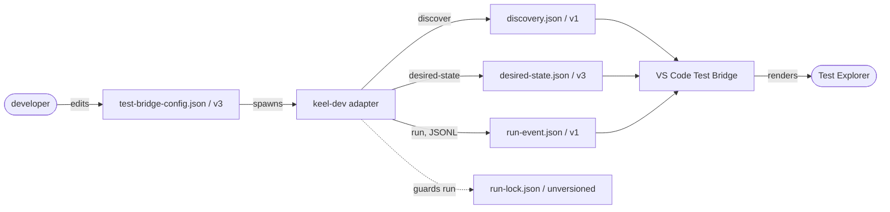
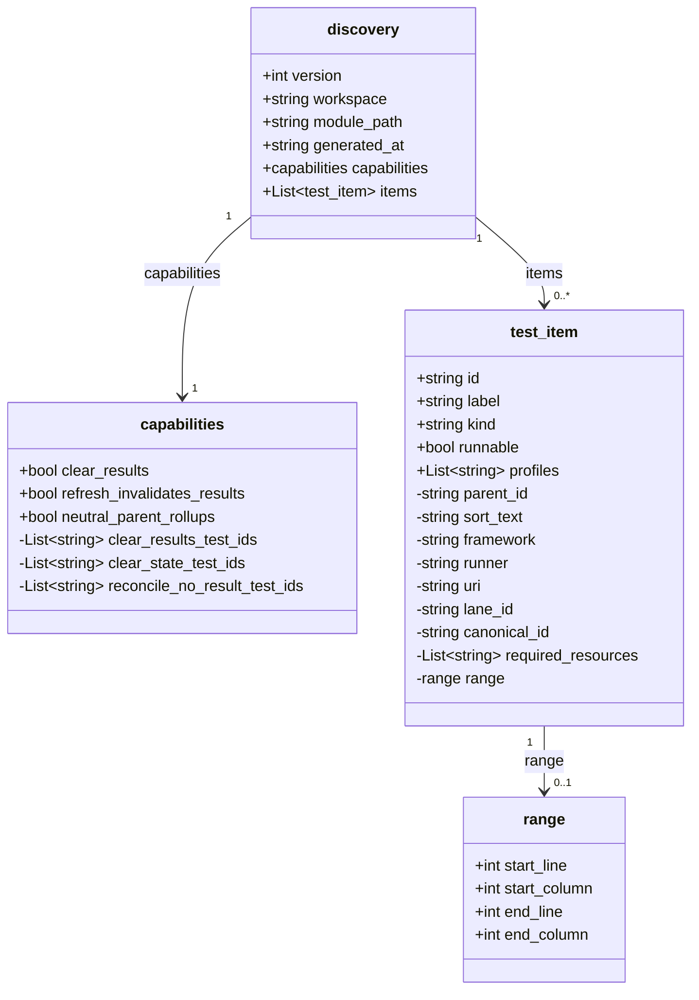
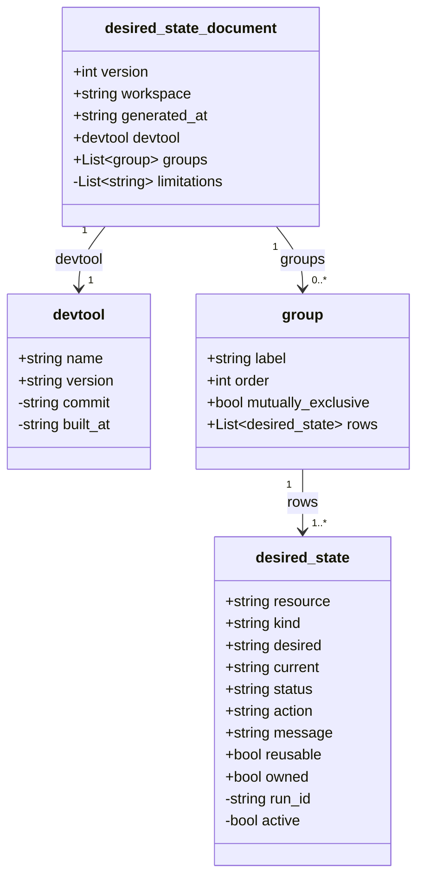
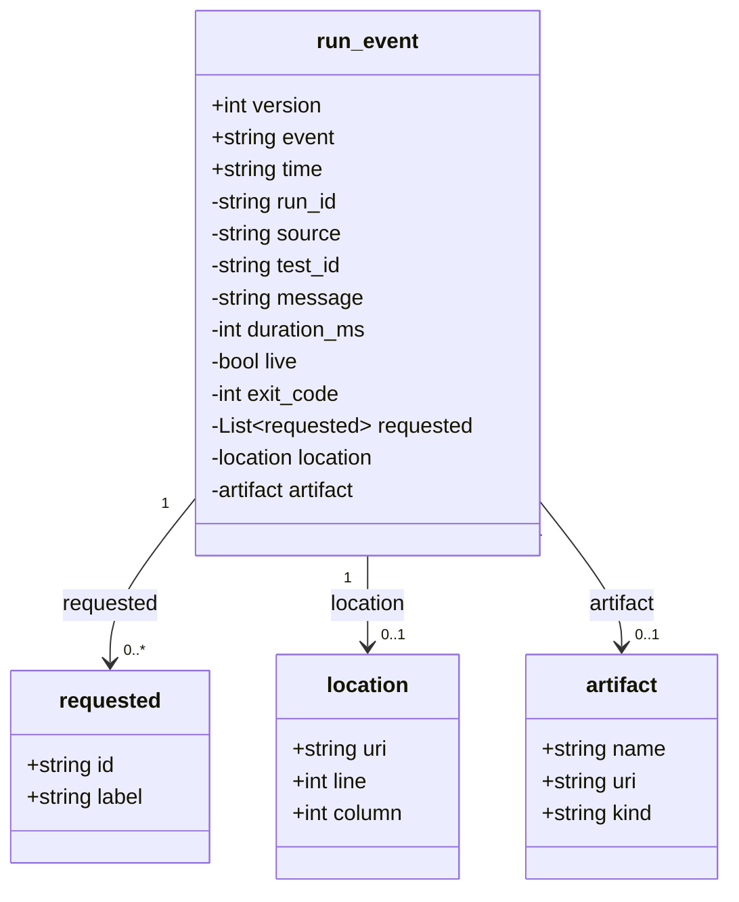
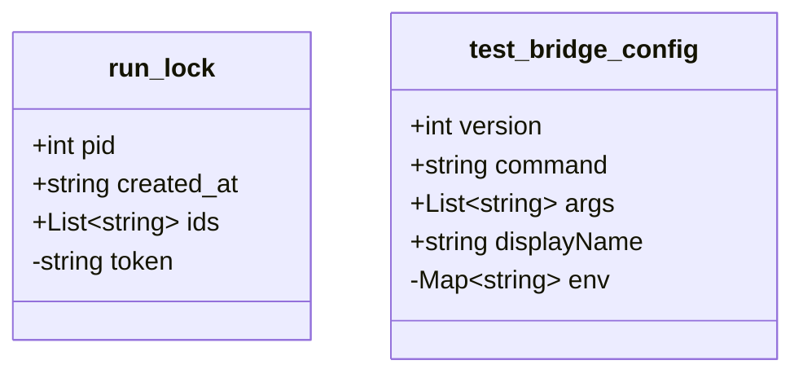

# keel test-bridge wire schema

The versioned JSON contract between the **keel-dev adapter** and the **VS Code Test Bridge**, transcribed from `vscode/schemas/*.json` @ `082da75`. These diagrams are a rendered view — the schemas remain the source of truth (drift-gated by `schema_drift_test.go` + `wire_stability_test.go`).

**Reading the class diagrams:** `+` marks a required field, `-` an optional one. `List~T~` is a JSON array of `T`. Relationship labels and multiplicities (`1`, `0..*`, `1..*`, `0..1`) show how documents nest. Enum domains are listed under each diagram. The DesiredStateDocument fields removed in v3 are listed under that diagram (issue-57 · requirement-60 AC 9 · CR-86).

---

## Protocol flow

---

## discovery.json — version 1

The 4-group Test Explorer tree as a flat item list linked by `parent_id`.

- `test_item.kind` — root, lane, package, file, suite, test, project, group, maintenance
- `test_item.profiles` — run, debug, coverage
- `capabilities.reconcile_no_result_test_ids` — bridge-computed authority for exclusive desired-state rendering: ids whose rendered result the consumer drops to no-result on **every** discovery refresh (rows with derived `active = false`, incl. the inactive Unknown State peer). Applied verbatim — no consumer branching on `mutually_exclusive` (requirement-95, supersedes requirement-93's post-run-only reconcile)

---

## desired-state.json — version 3

Read-only desired-state report per selection. `groups` then `rows` is the live model. The diagram shows only that live model; the pre-rename residue CR-86 deletes is listed below it.

- `desired_state.kind` — tool, dependency, binary, host-port-set, fixture-data, credential, service, unknown
- `desired_state.status` — satisfied, blocked, reconcilable
- `desired_state.action` — reuse, manual_setup_required, reconcile, reconcile_during_run
- Group invariant: if `mutually_exclusive` is true, exactly one row has `active = true`
- Row invariant: a row is runnable when it carries a `run_id`
- **Removed in v3 (CR-86):** the top-level `items`, `required_resources`, `checks`, `actions`, and `teardown` fields — pre-rename residue the `groups[].rows` already carry

> **v3 target shape (CR-86):** envelope + `groups[]` only. The ownership split lives per-row in `reusable`/`owned`; at most one optional `teardown_policy` string survives at the top. The schema rejects the removed fields — a pre-1.0 clean break (dev_defaults **T13**).

---

## run-event.json — version 1 — JSONL stream

One event per line. Every run **must** end with a single terminal `run_finished` carrying `exit_code` — even on crash.

- `run_event.event` — run_started, test_started, output, passed, failed, errored, cancelled, skipped, cleared, artifact, run_finished (`cleared` drops the named item to no-result — bridge-owned exclusive-group sibling deactivation, requirement-88; the consumer invalidates the item rather than stamping a terminal state)
- `run_event.source` — vscode, external
- `artifact.kind` — log, trace, screenshot, video, coverage, report, other

---

## run-lock.json — unversioned  and  test-bridge-config.json — version 3

- `run_lock` has **no `version` field** — the only unversioned document; a genuine inconsistency worth deciding on.
- `test_bridge_config.env` is a map of string to string. Config versions independently of the module tag; `test-bridge config upgrade` owns its migration.
