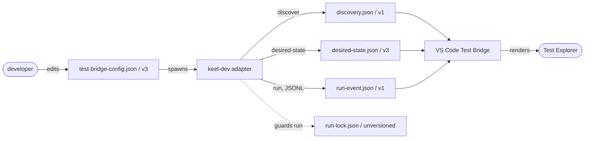
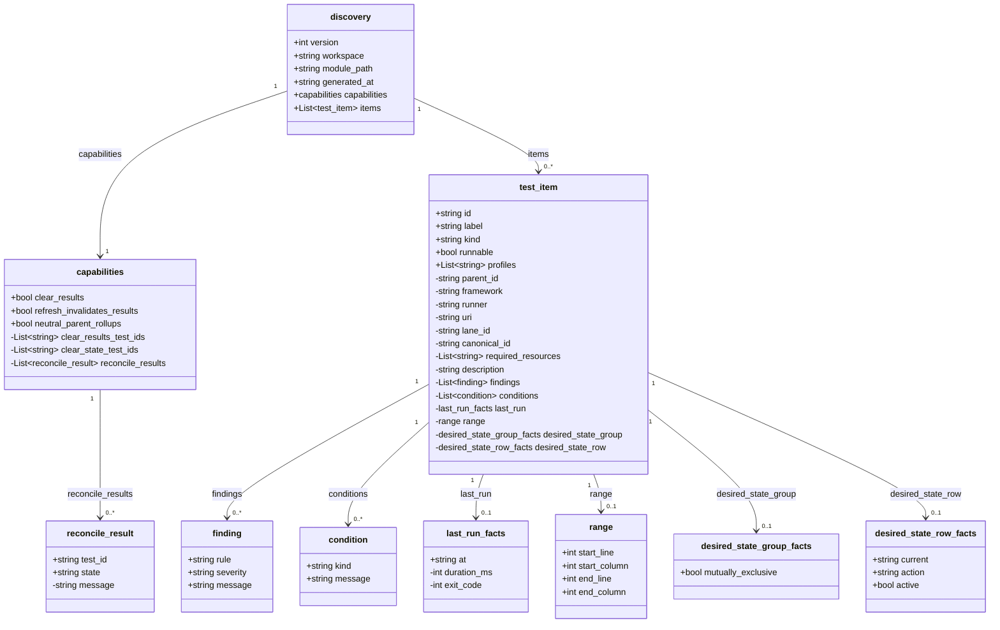
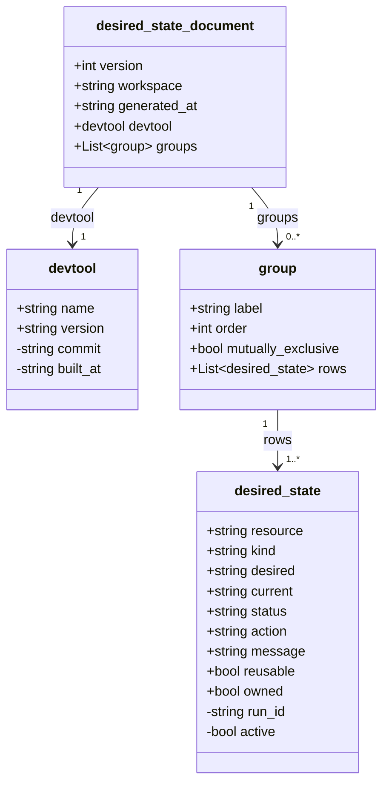
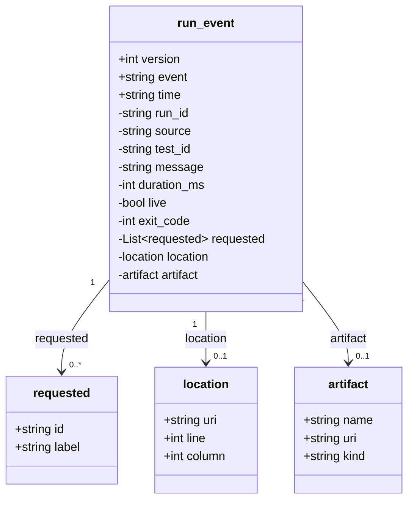
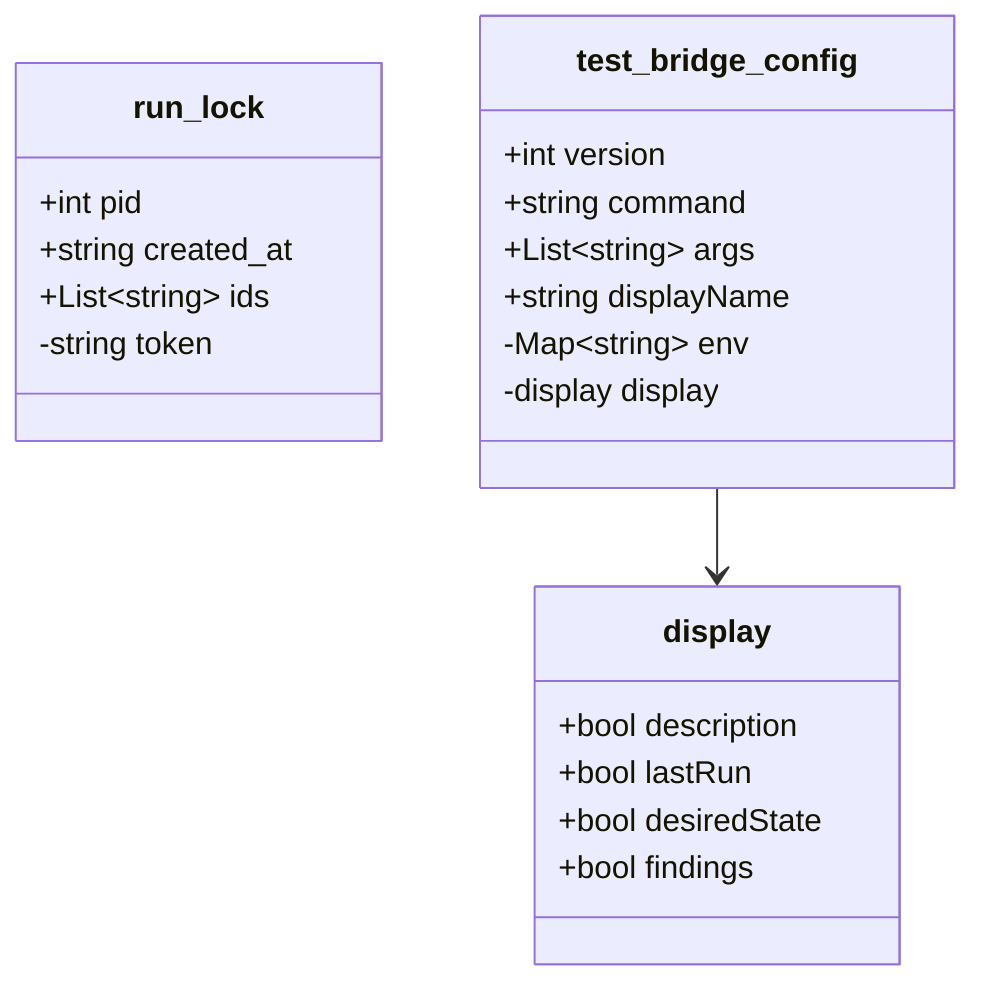

# keel test-bridge wire schema

The versioned JSON contract between the **keel-dev adapter** and the **VS Code Test Bridge**, transcribed from `vscode/schemas/*.json` @ `082da75`. These diagrams are a rendered view — the schemas remain the source of truth (drift-gated by `schema_drift_test.go` + `wire_stability_test.go`).

**Reading the class diagrams:** `+` marks a required field, `-` an optional one. `List~T~` is a JSON array of `T`. Relationship labels and multiplicities (`1`, `0..*`, `1..*`, `0..1`) show how documents nest. Enum domains are listed under each diagram. The DesiredStateDocument fields removed in v3 are listed under that diagram (issue-57 · requirement-60 AC 9 · CR-86).

---

## Protocol flow

```mermaid
flowchart LR
    dev([developer]) -->|edits| CFG["test-bridge-config.json / v3"]
    CFG -->|spawns| ADP[keel-dev adapter]
    ADP -->|discover| DISC["discovery.json / v1"]
    ADP -->|desired-state| STATE["desired-state.json / v3"]
    ADP -->|run, JSONL| RUN["run-event.json / v1"]
    ADP -.->|guards run| LOCK["run-lock.json / unversioned"]
    DISC --> VSIX[VS Code Test Bridge]
    STATE --> VSIX
    RUN --> VSIX
    VSIX -->|renders| tree([Test Explorer])
```

---

## discovery.json — version 1

The 4-group Test Explorer tree as a flat item list linked by `parent_id`.

The VS Code Test Bridge reads the discovery document and desired-state document
through bounded stdout. The built-in bound is **33554432 bytes**, and a workspace
may override it with the optional `discoveryMaxBufferBytes` field in
`.vscode/test-bridge.json` (an integer between 1024 and 536870912 bytes; an
out-of-range or non-numeric value is rejected when the config is read, never
coerced). The effective bound — the override when present, otherwise the
built-in default — is what every enforcement site applies and what the breach
error names, so a producer deriving its emission budget from the bound resolves
the same number the consumer enforces. A producer document that exceeds the
effective bound is rejected by the consumer. The failed refresh state is also
defined: on any failed discovery refresh, including a size-bound breach, non-zero
producer exit, malformed discovery JSON, or missing producer binary, the consumer
clears the published Test Explorer tree instead of leaving the previous item set
visible.

```mermaid
classDiagram
    class discovery {
        +int version
        +string workspace
        +string module_path
        +string generated_at
        +capabilities capabilities
        +List~test_item~ items
    }
    class capabilities {
        +bool clear_results
        +bool refresh_invalidates_results
        +bool neutral_parent_rollups
        -List~string~ clear_results_test_ids
        -List~string~ clear_state_test_ids
        -List~reconcile_result~ reconcile_results
    }
    class reconcile_result {
        +string test_id
        +string state
        -string message
    }
    class test_item {
        +string id
        +string label
        +string kind
        +bool runnable
        +List~string~ profiles
        -string parent_id
        -string framework
        -string runner
        -string uri
        -string lane_id
        -string canonical_id
        -List~string~ required_resources
        -string description
        -List~finding~ findings
        -List~condition~ conditions
        -last_run_facts last_run
        -range range
        -desired_state_group_facts desired_state_group
        -desired_state_row_facts desired_state_row
    }
    class finding {
        +string rule
        +string severity
        +string message
    }
    class condition {
        +string kind
        +string message
    }
    class last_run_facts {
        +string at
        -int duration_ms
        -int exit_code
    }
    class range {
        +int start_line
        +int start_column
        +int end_line
        +int end_column
    }
    class desired_state_group_facts {
        +bool mutually_exclusive
    }
    class desired_state_row_facts {
        +string current
        +string action
        +bool active
    }
    discovery "1" --> "1" capabilities : capabilities
    capabilities "1" --> "0..*" reconcile_result : reconcile_results
    discovery "1" --> "0..*" test_item : items
    test_item "1" --> "0..*" finding : findings
    test_item "1" --> "0..*" condition : conditions
    test_item "1" --> "0..1" last_run_facts : last_run
    test_item "1" --> "0..1" range : range
    test_item "1" --> "0..1" desired_state_group_facts : desired_state_group
    test_item "1" --> "0..1" desired_state_row_facts : desired_state_row
```

- `test_item.kind` — root, lane, package, file, suite, test, project, group, maintenance
- `test_item.profiles` — run, debug, coverage
- `test_item.description` — the producer's own prose for this item, one string, never a composed line. Sequencing it against anything else is the consumer's job. It is the item's only prose channel: the `limitations` array it replaced is retired, and a document still carrying that field is refused (requirement-138)
- `test_item.findings` — the typed validation findings raised against this item: `rule`, `severity`, `message`, with `severity` a closed enum (error, warning). Severity is the fact a consumer selects a surface by, so it never travels as a token inside a message (requirement-138)
- `test_item.conditions` — the persistent non-result conditions standing against this item at discovery time: `kind`, `message`, with `kind` a closed enum (parse_error, prerequisite_unsatisfied). A condition has no run behind it and holds until the producer stops reporting it, so the consumer routes it to `vscode.TestItem.error` — the platform's own slot for a discovery error — rather than to a run result. Several conditions on one item accumulate into that one value; an error-severity `finding` reaches the same surface, a warning-severity one stays in the composed description (requirement-140)
- `test_item.last_run` — the typed measurement of the newest run attributable to this item alone: newest persisted stream whose `requested` set is exactly that one item, failed runs included, multi-selection runs excluded (requirement-53). `duration_ms` and `exit_code` are optional so a measured zero stays distinguishable from an absent measurement; a lane with no attributable stream carries no `last_run` member at all, never a zero (requirement-138)
- `test_item.desired_state_group` / `test_item.desired_state_row` — the typed desired-state facts, present only on the item kind they describe. Their presence is what identifies an item as a desired-state group or row; `action` is a closed enum (reuse, manual_setup_required, reconcile, reconcile_during_run) shared with `desired_state.action`. Until v0.7.3 these four facts were formatted into the retired `limitations` array as `k=v` text and recovered by substring match — a breaking wire change under design_decision-11, landed with producer and consumer on one tag (requirement-127)
- `capabilities.reconcile_results` — bridge-computed rendered truth for desired-state rows. Exclusive groups serve one stamp per row with a run id: the derived-active row `state: passed`, every other row (incl. the Unknown State peer) `state: skipped` (closed enum). Non-exclusive groups serve `state: passed` for each run-id-bearing row whose bridge-derived status is `satisfied`, and serve no entry for every other non-exclusive row. The consumer replays the entries verbatim through one non-persisted TestRun per discovery refresh, **overwriting** stale results (incl. persistence-restored ones after a window reload) — no consumer branching on `mutually_exclusive` (requirement-97, requirement-145; replaced the never-released `reconcile_no_result_test_ids` after its removal mechanism was falsified on a live editor)

---

## desired-state.json — version 3

Read-only desired-state report per selection. `groups` then `rows` is the live model. The diagram shows only that live model; the pre-rename residue CR-86 deletes is listed below it.

```mermaid
classDiagram
    class desired_state_document {
        +int version
        +string workspace
        +string generated_at
        +devtool devtool
        +List~group~ groups
    }
    class devtool {
        +string name
        +string version
        -string commit
        -string built_at
    }
    class group {
        +string label
        +int order
        +bool mutually_exclusive
        +List~desired_state~ rows
    }
    class desired_state {
        +string resource
        +string kind
        +string desired
        +string current
        +string status
        +string action
        +string message
        +bool reusable
        +bool owned
        -string run_id
        -bool active
    }
    desired_state_document "1" --> "1" devtool : devtool
    desired_state_document "1" --> "0..*" group : groups
    group "1" --> "1..*" desired_state : rows
```

- `desired_state.kind` — tool, dependency, binary, host-port-set, fixture-data, credential, service, unknown
- `desired_state.status` — satisfied, blocked, reconcilable
- `desired_state.action` — reuse, manual_setup_required, reconcile, reconcile_during_run
- Group invariant: if `mutually_exclusive` is true, exactly one row has `active = true`
- Row invariant: a row is runnable when it carries a `run_id`
- **Removed in v3 (CR-86):** the top-level `items`, `required_resources`, `checks`, `actions`, and `teardown` fields — pre-rename residue the `groups[].rows` already carry

> **v3 target shape (CR-86):** envelope + `groups[]` only. The ownership split lives per-row in `reusable`/`owned`; at most one optional `teardown_policy` string survives at the top. The schema rejects the removed fields — a pre-1.0 clean break (dev_defaults **T13**).

---

## run-event.json — version 1 — JSONL stream

One event per line. Every run **must** end with a single terminal `run_finished` carrying `exit_code` — even on crash.

```mermaid
classDiagram
    class run_event {
        +int version
        +string event
        +string time
        -string run_id
        -string source
        -string test_id
        -string message
        -int duration_ms
        -bool live
        -int exit_code
        -List~requested~ requested
        -location location
        -artifact artifact
    }
    class requested {
        +string id
        +string label
    }
    class location {
        +string uri
        +int line
        +int column
    }
    class artifact {
        +string name
        +string uri
        +string kind
    }
    run_event "1" --> "0..*" requested : requested
    run_event "1" --> "0..1" location : location
    run_event "1" --> "0..1" artifact : artifact
```

- `run_event.event` — run_started, test_started, output, passed, failed, errored, cancelled, skipped, cleared, artifact, run_finished (`cleared` drops the named item to no-result — bridge-owned exclusive-group sibling deactivation, requirement-88; the consumer invalidates the item rather than stamping a terminal state)
- `run_event.source` — vscode, external, editor (two axes on one field, per keel/design_decision-14: `vscode` and `external` name which producer normalized the events; `editor` names the surface that initiated the run, and the extension's external-run mirror skips a stream carrying it. A stream with no recognized value is unattributed and is imported.)
- `artifact.kind` — log, trace, screenshot, video, coverage, report, other

---

## run-lock.json — unversioned  and  test-bridge-config.json — version 4

```mermaid
classDiagram
    class run_lock {
        +int pid
        +string created_at
        +List~string~ ids
        -string token
    }
    class test_bridge_config {
        +int version
        +string command
        +List~string~ args
        +string displayName
        -Map~string~ env
        -display display
    }
    class display {
        +bool description
        +bool lastRun
        +bool desiredState
        +bool findings
    }
    test_bridge_config --> display
```

- `run_lock` has **no `version` field** — the only unversioned document; a genuine inconsistency worth deciding on.
- `test_bridge_config.env` is a map of string to string. Config versions independently of the module tag; `test-bridge config upgrade` owns its migration.
- `test_bridge_config.display` is optional and carries one toggle per rendered fact class, in the order the extension composes them. An absent block means every class is enabled. An unknown key inside it is refused at config read (keel/requirement-139).
